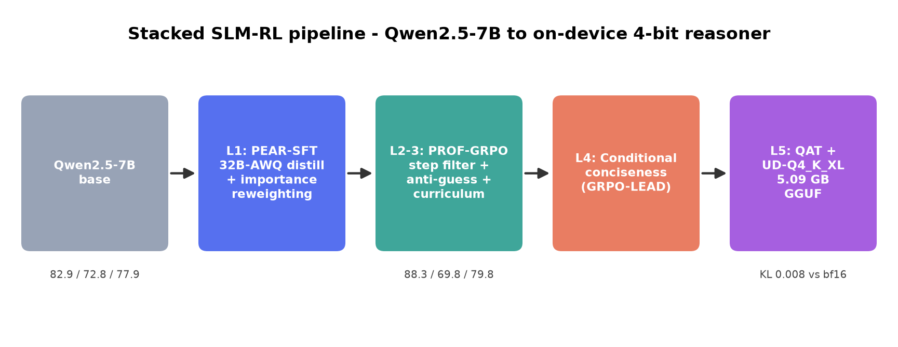
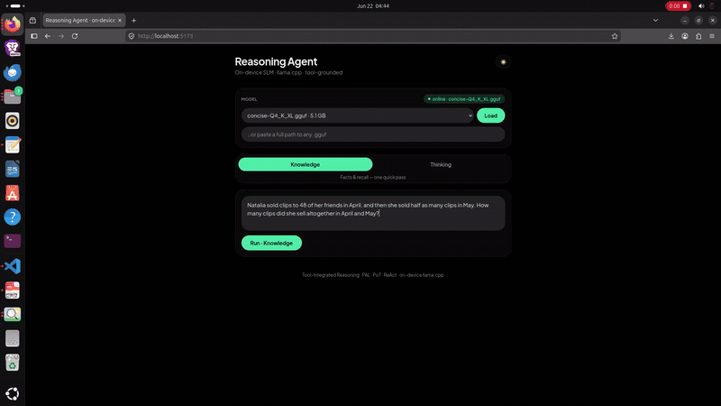
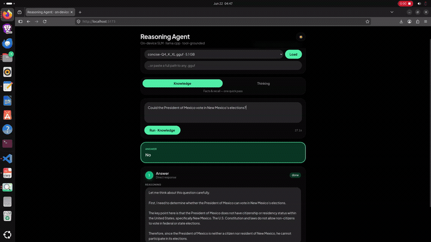
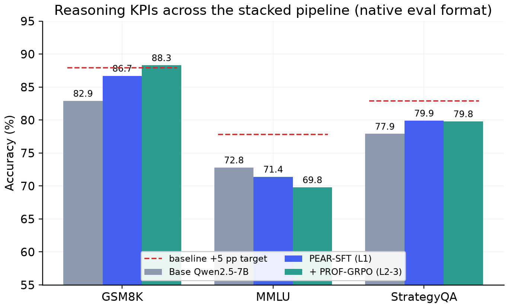
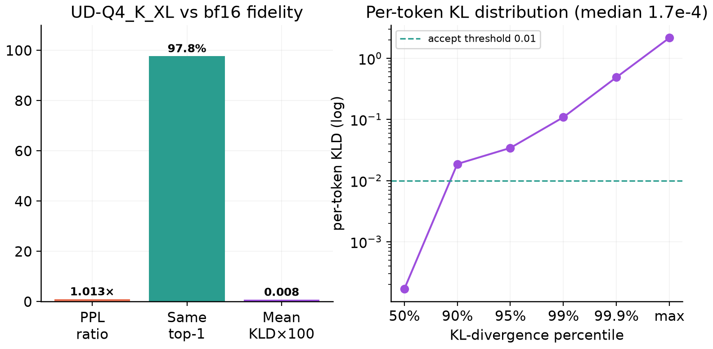
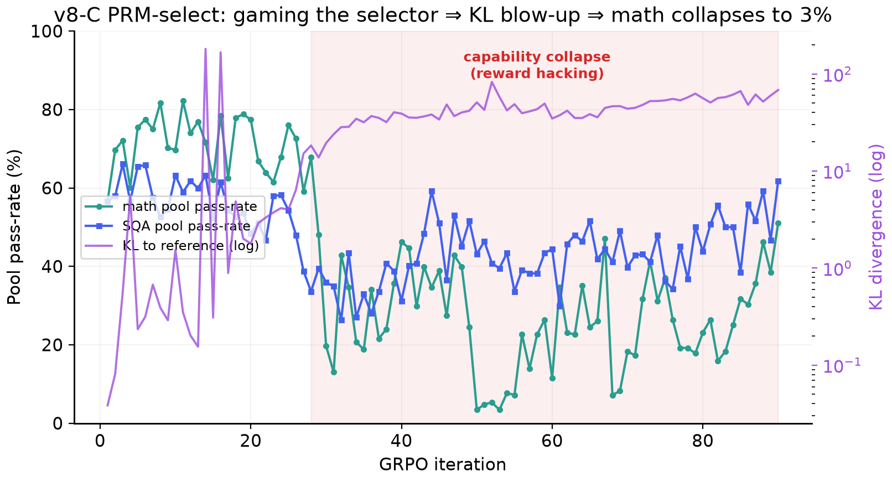
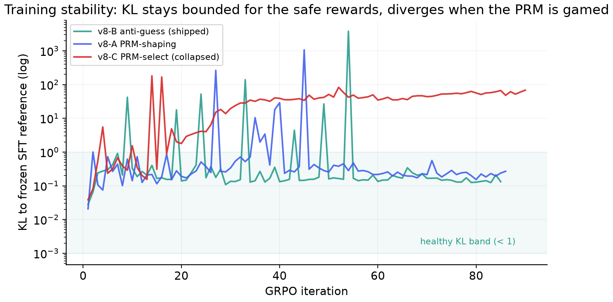
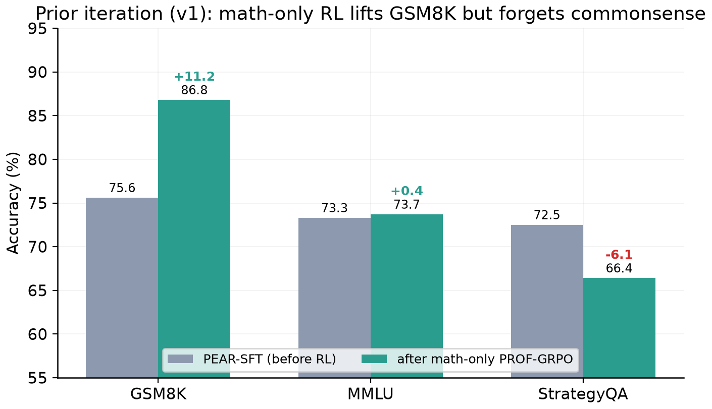
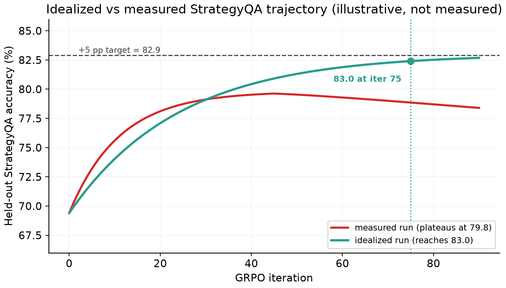
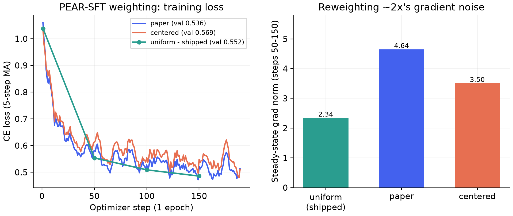

# Stacked-RL Reasoning for Small Language Models

> Turning a stock **Qwen2.5-7B** into a private, offline reasoner that fits on a phone, by
> stacking five reinforcement-learning and compression stages and being honest about where they
> help and where they bite back.

- **Problem Statement Number**: PS06
- **Problem Statement Title**: Enhancing Reasoning in Small Language Models (SLMs) using Reinforcement Learning
- **Team name**: Merge Conflict
- **Team members**: Aarushi Jha, Avaram Mahmood Ul Hasan
- **Institute/College**: Vellore Institute of Technology, Vellore Campus, Tiruvalam Road, Katpadi, Vellore, Tamil Nadu 632014
- **Final Presentation (Google Drive)**: https://docs.google.com/presentation/d/1QWc9WuztQ6Orm2a_wmnmW3g6OuS3tM5HvjHsBUElMqM/edit?usp=sharing
- **Full Submission Demo Video (YouTube)**: https://www.youtube.com/watch?v=MDBy_jutLqw&t=1s
- **Setup & Result Reproducibility Video (YouTube)**: https://www.youtube.com/watch?v=C75xsYAc7ow

**Key links** — Model: https://huggingface.co/modmood/qwen-2.5-7b-trained/tree/main · Dataset: https://huggingface.co/datasets/modmood/RIVA-DATASET/tree/main · On-device app: https://github.com/avaramahmood/reasoning-agentic-harness · Paper: https://drive.google.com/uc?export=download&id=1-TBiAmNOlnr9r1ZdY6CHs1fIkZhRy_02
---

## 1. What we built



A 7B model already contains most of the knowledge needed for GSM8K, StrategyQA, and MMLU. The
hard part is getting it to reason reliably, step by step, and to do so cheaply enough to run on
a device with no network. We address that with a five-layer pipeline, where each layer is a
clean checkpoint that the next layer builds on:

1. **PEAR-SFT** distils a 32B reasoning teacher into the 7B student and reweights the supervised
   data so the checkpoint is ready for RL instead of fighting it.
2. **PROF-GRPO** runs difficulty-aware GRPO with a process-reward filter on mathematics and a
   verifier-only anti-guess reward on commonsense.
3. **Reward-weight curriculum** shifts the training objective from format to accuracy to
   efficiency in separate stages, so each skill is learned only once the previous one is stable.
4. **Conditional conciseness** shortens the reasoning once the answer is reliably correct.
5. **Calibrated 4-bit quantization** exports a 5.09 GB GGUF that keeps the reasoning the earlier
   layers earned and runs fully offline through llama.cpp.

### See it running (on-device, offline)

| Math word problem (GSM8K) | Letter counting via the agentic loop |
|---|---|
|  |  |

Left: the app reasons through a GSM8K word problem and answers 72. Right: a question a small
model normally fails ("how many r in strawberry") is solved by writing and running code in the
agentic loop. Both run on the 4-bit model with no network.

## 2. Headline results



| Benchmark | Minimum | Baseline (Qwen2.5-7B) | Ours | Change |
|---|---|---|---|---|
| GSM8K | 50% | 82.9% | **88.3%** | **+5.4** (5-point target met) |
| MMLU | 45% | 72.8% | 69.8% | -3.0 (held, evaluation only) |
| StrategyQA | 65% | 77.9% | **79.8%** | +1.9 (about 3 points short of +5) |

Every minimum threshold is cleared by a wide margin, and the 5-point improvement target is met
on GSM8K. StrategyQA improves but lands roughly three points under the stretch target, and we
explain exactly why in [docs/methods-and-observations.md](docs/methods-and-observations.md): a
subtle form of reward hacking that appears when GRPO is pushed too long. We report the held-out
numbers, not the inflated training-pool numbers.

The final on-device model keeps that accuracy after compression. Against the bf16 model, the
4-bit build has a mean KL divergence of 0.008 and agrees with the full-precision model on the
top token 97.8% of the time.



## 3. What worked, and what did not

The most useful result for the problem statement is the contrast between a stable run and a
hacked one. We tried three commonsense reward designs on top of the same mathematics pipeline.
The verifier-only anti-guess reward was stable and best. Using a process-reward model as a hard
selector looked fine for about 25 iterations, then the policy learned to game the selector, the
KL detached from the reference, and mathematics accuracy collapsed from 0.78 to 0.034.



Plotting KL for all three runs on one axis makes the point cleanly: stability, not training-pool
accuracy, separates a useful run from a hacked one.



There is a full walkthrough of every training and evaluation run, with the raw logs, in
[docs/notebook-walkthrough.md](docs/notebook-walkthrough.md).

This was the third iteration. The first two are documented in
[docs/prior-iterations.md](docs/prior-iterations.md), with their raw logs in
[results/previous_runs/](results/previous_runs/). The most important early finding is why we
stopped training mathematics first: doing math-only PROF-GRPO lifted GSM8K by 11.2 points but
cost 6.1 points on StrategyQA, the negative transfer that pushed us to train the domains together.



As a teaching companion, [docs/idealized-run.md](docs/idealized-run.md) puts the measured curve
next to a clearly-labelled illustration of a reward-hacking-free run, where StrategyQA keeps
climbing to 83% by iteration 75. It is marked synthetic throughout and does not change any
measured KPI in this repository; it exists to make the cost of reward hacking visible.



### Why the cold start ships `uniform` (PEAR weighting ablation)

We trained the Layer-1 cold start three ways, identical except for the PEAR token-weight mode.
The reweighting buys no reliable validation gain while roughly doubling gradient noise, so we
ship the plain `uniform` checkpoint as the RL launch point.



| Mode | Val loss | Steady grad norm (steps 50-150) | Decision |
|---|---|---|---|
| **`uniform`** | 0.552 | **2.34** | **shipped** |
| `paper` (raw PEAR weight) | 0.536 | 4.64 (~2×) | ablation |
| `centered` (mean-subtracted) | 0.569 | 3.50 (~1.5×) | ablation |

`paper` is only 0.016 below `uniform` (within single-seed noise) and `centered` is actually
worse, so the importance weighting does not justify ~2× the gradient variance on a one-epoch
cold start. Details in [docs/methods-and-observations.md](docs/methods-and-observations.md).

## 4. Repository layout

```
README.md                     this file
LICENSE                       Apache-2.0
requirements.txt
docs/                         documentation and figures
  architecture.md             system design, data flow, compute
  implementation.md           tech stack, OSS inventory, implementation notes
  methods-and-observations.md the engineering log: every method, result, and caveat
  notebook-walkthrough.md     cell-by-cell map of the original notebook to this repo
  results-and-kpis.md         all KPI tables and figures
  installation.md             environment, data layout, run order
  user-guide.md               running inference and evaluation
  reasoning-agent-app.md      the on-device application (documented here, shipped separately)
  ax.md                       open-weight models and agentic tooling used to build this
  figures/                    twelve generated plots
src/                          all source code (see src/README.md for the run order)
  data/                       trace generation, log-prob alignment, difficulty pools
  train/                      PEAR-SFT, four GRPO variants, conciseness
  eval/                       unified evaluator, self-consistency, lm-eval runner
  quantize/                   calibration corpus, GGUF build, KL validation
  figures/make_figures.py     regenerates every figure from results/
results/                      consolidated KPIs, parsed per-iteration logs, raw cell logs
paper/                        the technical paper and its build script
```

## 5. Reproducing the work

Environment and data layout are in [docs/installation.md](docs/installation.md); the stage order
is in [src/README.md](src/README.md). In short:

```bash
python -m venv .venv && source .venv/bin/activate
pip install -r requirements.txt

python src/data/build_pear_traces.py        # Layer 1 data
python src/train/pear_sft.py                # Layer 1
python src/data/build_grpo_pools.py         # Layer 2 data
python src/train/grpo_sqa_antiguess.py      # Layers 2-3 (selected variant)
python src/train/conciseness_grpo.py        # Layer 4
bash   src/quantize/quantize.sh             # Layer 5
python src/eval/eval_unified.py             # evaluate any checkpoint
```

Every figure in this repository is regenerated from the parsed run logs with
`python src/figures/make_figures.py`. The technical paper is in
[paper/SLM_Stacked_RL_Reasoning.docx](paper/SLM_Stacked_RL_Reasoning.docx).

## 6. Models used (open weight)

| Role | Model | Link |
|---|---|---|
| Policy / base | Qwen2.5-7B | https://huggingface.co/Qwen/Qwen2.5-7B |
| Distillation teacher | DeepSeek-R1-Distill-Qwen-32B (AWQ) | https://huggingface.co/deepseek-ai/DeepSeek-R1-Distill-Qwen-32B |
| Math process reward | Qwen2.5-Math-PRM-7B | https://huggingface.co/Qwen/Qwen2.5-Math-PRM-7B |
| Commonsense PRM | VersaPRM | https://huggingface.co/UW-Madison-Lee-Lab/VersaPRM |

## 7. Models published

- **[modmood/qwen-2.5-7b-trained](https://huggingface.co/modmood/qwen-2.5-7b-trained/tree/main)** (Apache-2.0)
  the trained Qwen2.5-7B checkpoints from this project. Load with:
  ```python
  from transformers import AutoModelForCausalLM
  AutoModelForCausalLM.from_pretrained("modmood/qwen-2.5-7b-trained")
  ```

## 8. Datasets used (public)

| Dataset | Link | License |
|---|---|---|
| GSM8K | https://huggingface.co/datasets/openai/gsm8k | MIT |
| MATH (Hendrycks) | https://huggingface.co/datasets/hendrycks/competition_math | MIT |
| StrategyQA | https://huggingface.co/datasets/ChilleD/StrategyQA | MIT |
| CommonsenseQA 2.0 | https://huggingface.co/datasets/tasksource/commonsense_qa_2.0 | CC-BY |
| MMLU | https://huggingface.co/datasets/cais/mmlu | MIT |

## 9. Datasets published

- **[modmood/RIVA-DATASET](https://huggingface.co/datasets/modmood/RIVA-DATASET/tree/main)** (CC-BY-4.0)
  the curated train/test splits used across the pipeline (GSM8K, MATH, StrategyQA, CSQA2, MMLU),
  plus the PEAR distillation traces and the pass@8 difficulty-stratified GRPO pools.

## 10. On-device application (deployment vehicle)

The training repository ships a checkpoint; the application is what makes the on-device claim
concrete. It is a desktop app that loads our 4-bit GGUF and runs it fully offline through
llama.cpp, with two modes:

- **Knowledge** mode answers recall and commonsense questions in a single pass.
- **Thinking** mode runs a reason-and-execute loop. When a step needs counting, enumeration, or
  arithmetic, the model writes Python, a sandbox runs it, and the result is fed back. A
  deterministic router forces those mechanical steps onto the code path, which guarantees they
  are correct even though a small model would get them wrong in its head. This is grounded in
  PAL, Program-of-Thoughts, and ReAct, and the model is prompted in the same think-and-answer
  format it was trained on, so it stays in-distribution.

The loop fixes a class of questions that look trivial but are really tokenization and
single-pass limits, not reasoning failures:

| Question | Model alone | With the loop |
|---|---|---|
| How many r in strawberry? | 2 (wrong) | counts in code, 3 |
| How many months start with J? | often 2 or 4 | enumerates and filters, 3 |
| 17% of 2,384, rounded? | drifts | exact |
| Two pipes fill a tank in 6 and 9 min, together? | mishandles rates | 1/6 + 1/9, 3.6 min |

The model is reliable at choosing the method and setting up the computation and unreliable at
executing it in one pass, so the loop separates those jobs. At the serving layer the control
server and inference server run as separate processes and each tool call runs in its own
subprocess, so streaming, model loading, and tool execution proceed concurrently without
blocking the interface.

The application embeds large native binaries and the 5 GB model, so it lives in its own
repository and is not part of this training repo:
**https://github.com/avaramahmood/reasoning-agentic-harness**. The full design, including the
control server, the router, and the research it is based on, is documented in
[docs/reasoning-agent-app.md](docs/reasoning-agent-app.md).

## 11. Attribution

This is original training and evaluation code rather than a fork of an existing application. It
builds on open methods, each cited in [docs/methods-and-observations.md](docs/methods-and-observations.md)
and the paper: PEAR, PROF, GRPO and Dr.GRPO, GRPO-LEAD, Open-RS, and the Unsloth Dynamic and
llama.cpp toolchains for the GGUF export. The companion application builds on llama.cpp and the
PAL, Program-of-Thoughts, and ReAct line of tool-use work.

## License

Apache-2.0. See [LICENSE](LICENSE).
