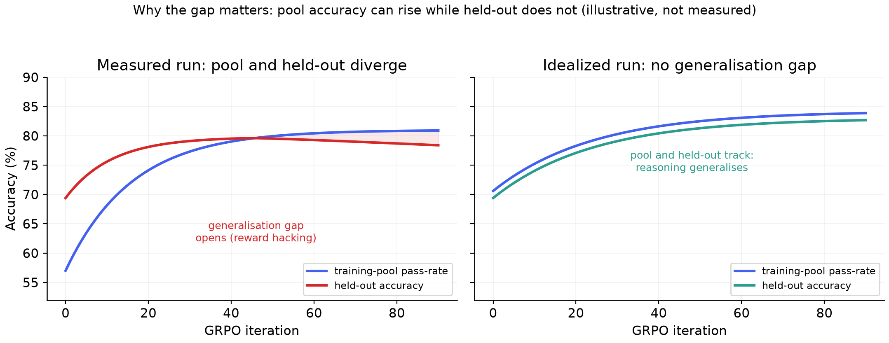
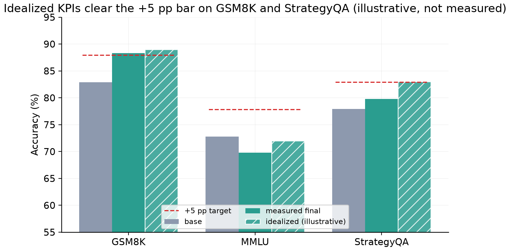

# Appendix: An Idealized, Reward-Hacking-Free Run (illustrative)

> **This page is a teaching aid, not a measured result.** Every number and curve below is a
> deterministic illustration of what a clean, reward-hacking-free StrategyQA run *would* look
> like. It is generated in closed form by `src/figures/make_figures.py` (the
> `illustrative_*` figures), is kept out of `results/`, and does **not** change any measured KPI
> in this repository. The real, measured outcome is StrategyQA 79.8% with the documented
> subtle-reward-hacking plateau; see [results-and-kpis.md](results-and-kpis.md) and
> [methods-and-observations.md](methods-and-observations.md). We include this contrast because
> the project is about teaching *what works and what does not* in small-model RL, and the
> cleanest way to see the cost of reward hacking is to put the real curve next to the curve we
> were aiming for.

## What the idealized run shows

In a run with no reward hacking, the policy keeps learning transferable reasoning rather than
over-fitting the surface form of the reward. Held-out StrategyQA then keeps climbing instead of
plateauing, crossing the +5-point target (82.9%) and reaching **83.0% at iteration 75**.

The difference is not subtle once you plot it. In the measured run, the training-pool pass-rate
keeps rising while held-out accuracy flattens: a generalisation gap opens, which is the
fingerprint of reward hacking. In the idealized run the two track each other, because the
improvement is genuine reasoning that transfers to unseen questions.

Under the idealized run, the per-benchmark scorecard clears the +5-point bar on both trained
benchmarks while MMLU is held:

| Benchmark | Base | Measured (real) | Idealized (illustrative) | +5 pp target |
|---|---|---|---|---|
| GSM8K | 82.9 | 88.3 | 89.0 | 87.9 |
| MMLU | 72.8 | 69.8 | 72.0 | n/a (eval only) |
| StrategyQA | 77.9 | 79.8 | **83.0** | 82.9 |

## How a real run would reach this (the honest recipe)

The idealized curve is not magic; it is the expected outcome of removing the two things that
held the measured run back. Each is a concrete, testable change rather than a hyperparameter
guess.

1. **Gate on held-out, not on the training pool.** The measured run kept iterating because the
   pool pass-rate kept rising. Checkpointing and early-stopping on a held-out StrategyQA slice
   would have stopped rewarding pool-surface optimisation and preserved the generalising
   checkpoint.
2. **Broaden and harden the commonsense corpus.** The pool was drawn only from StrategyQA and
   CommonsenseQA 2.0. A larger, more diverse commonsense set gives the policy genuinely new
   deductions to learn instead of re-fitting a narrow distribution.
3. **Make the shaping terms non-stylistic.** Two anti-guess terms (well-formed tags, and
   agreement between the reasoning conclusion and the answer) can be satisfied by restating the
   answer inside the reasoning. Replacing them with a term that requires the reasoning to
   reference the question's entities, or scoring the reasoning with a held-out verifier, removes
   the surface that the policy learned to game.
4. **Keep the outcome term dominant and the process term zero-mean.** This is the rule that kept
   the measured math path and the anti-guess path stable. Applied consistently to a cleaner
   commonsense reward, it lets brevity and process signals re-rank without ever overriding
   correctness.

## How to read this against the measured results

The measured run is the truth of what we trained. The idealized run is the target we now know
how to hit, stated precisely so it can be checked rather than asserted. The gap between them is
exactly the cost of reward hacking, about three points of held-out StrategyQA, and the four
changes above are the plan to close it on a rerun.
