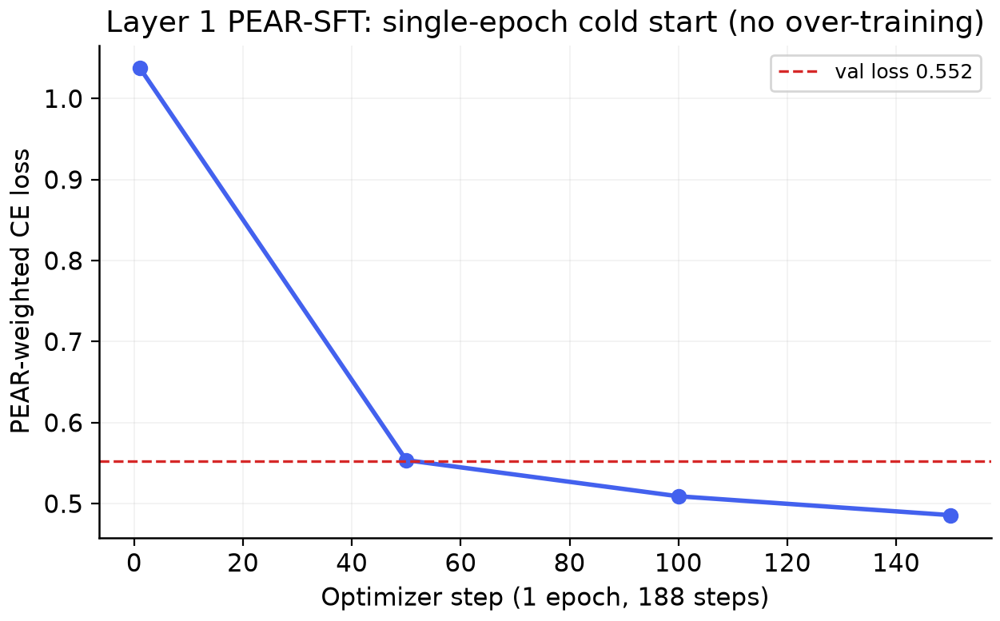
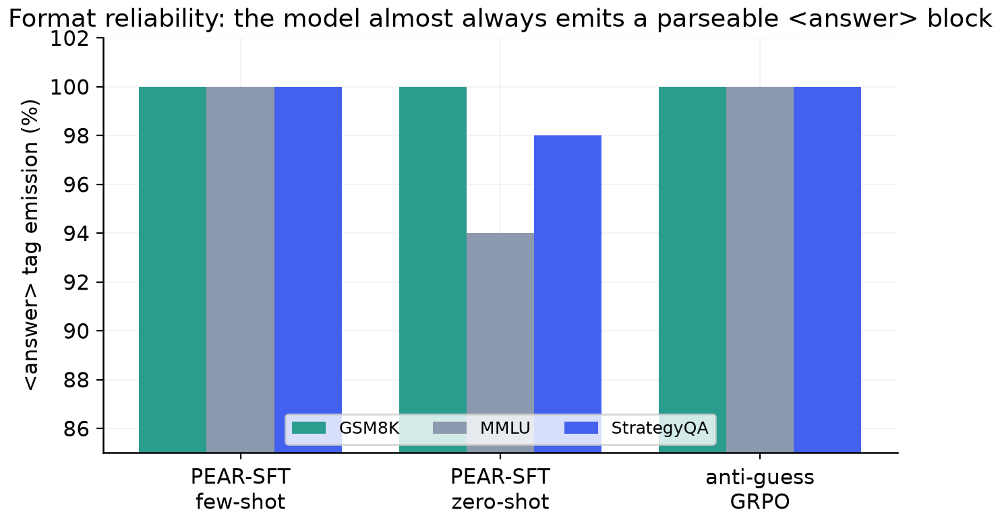
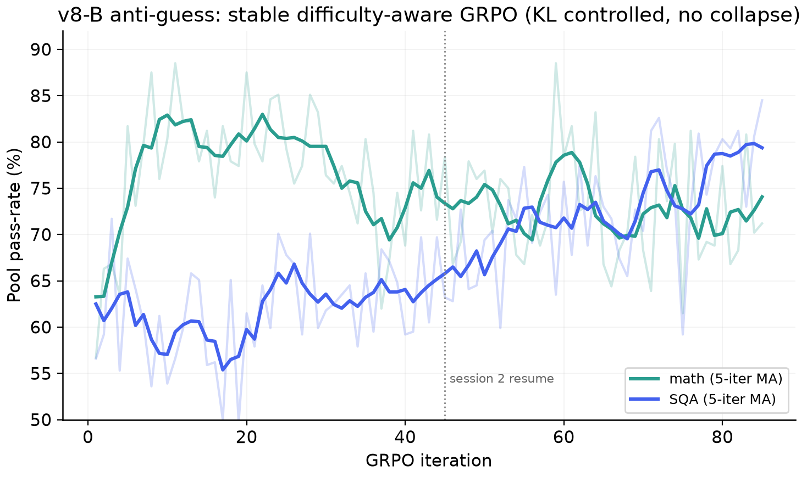

# Notebook Walkthrough: Code and Outputs, Cell by Cell

This page documents **every stage in `final.ipynb`**, what the code does and what it actually
printed, and points to where each output now lives in the repo. Raw logs are under
[`../results/notebook_outputs/`](../results/notebook_outputs/); parsed per-iteration series are
in [`../results/training_logs/`](../results/training_logs/) (`*.csv`); the cleaned, runnable
code is under [`../src/`](../src/).

> Note on the notebook: several **result blocks were pasted into code cells** (the eval
> summaries and the GRPO iteration logs for the later sessions). We treat those as outputs and
> have extracted them faithfully; the column at right says where each lives.

| Notebook cell(s) | Stage | Repo code | Repo output/log |
|---|---|---|---|
| 0 | Unified 3-mode eval harness | `src/eval/eval_unified.py` | (driver) |
| 1 | maj@8 self-consistency eval | `src/eval/eval_self_consistency.py` | (driver) |
| 3 | PEAR trace generation (32B→7B) | `src/data/build_pear_traces.py` | `pear_trace_generation.txt` |
| 4, 6 | Shared-tokenizer logprob re-score | `src/data/rescore_pear_aligned.py` | (in trace log) |
| 5 | PEAR-SFT training | `src/train/pear_sft.py` | `pear_sft_training.txt`, `pear_sft.csv` |
| 8 | Base eval (few-shot) | `eval_unified.py` | `eval_base_fewshot.txt` |
| 10, 12 | SFT eval (few-shot / zero-shot) | `eval_unified.py` | `eval_sft_*.txt` |
| 13 | pass@8 difficulty pool builder | `src/data/build_grpo_pools.py` | `pool_builder.txt`, `pool_pass8_distribution.json` |
| 14, 15 | GRPO v8-A (PRM-shaping) train | `src/train/grpo_sqa_prm_shaping.py` | `train_grpo_prm_shaping_*.txt`, `grpo_prm_shaping.csv` |
| 16 | GRPO v8-A eval | `eval_unified.py` | `eval_grpo_prm_shaping.txt` |
| 17, 18 | GRPO v8-B (anti-guess) train | `src/train/grpo_sqa_antiguess.py` | `train_grpo_antiguess_*.txt`, `grpo_antiguess.csv` |
| 19 | GRPO v8-B eval (**shipped**) | `eval_unified.py` | `eval_grpo_antiguess.txt` |
| 20, 21 | GRPO v8-C (PRM-select) train | `src/train/grpo_sqa_prm_select.py` | `train_grpo_prm_select_*.txt`, `grpo_prm_select.csv` |
| 22 | GRPO v8-C eval (collapsed) | `eval_unified.py` | `eval_grpo_prm_select.txt` |
| 23 | Conciseness GRPO (Layer 4) | `src/train/conciseness_grpo.py` | `train_conciseness.txt`, `conciseness.csv` |
| 24 | Quantization + KL validation | `src/quantize/{make_calib,quantize}.py` | `quantize_report.txt` |

---

## Layer 1: PEAR-SFT

### Cell 3: trace generation (`pear_trace_generation.txt`)
Loads the 32B-AWQ teacher and the 7B base, generates rollouts per domain (commonsense first,
then math, then MMLU), selects correct traces, and batch-scores per-token teacher/student
log-probs. **Yield:**

```
positive: 2422   negative: 820   skipped: 1942   rationalized: 0
neg_to_pos_ratio: 0.339   total kept: 3242
```

After the shared-tokenizer re-score (cells 4/6) the usable set is **8764 records, 0 dropped**
(all teacher/student arrays equal-length, the +2 misalignment bug is gone).

### Cell 5: SFT training (`pear_sft_training.txt`, `pear_sft.csv`)
One epoch, 188 optimizer steps, AdamW8bit, lr 1e-5, `PEAR_MODE=uniform`. Loss falls
**1.038 → 0.486** with **val loss 0.552** in 16.3 min.



The choice of `PEAR_MODE=uniform` is itself an ablation: we ran the same cold start with the
`paper` (raw PEAR weight) and `centered` (mean-subtracted) modes
(`pear_sft_paper.csv`, `pear_sft_centered.csv`). Reweighting gave no reliable val-loss gain
(paper 0.536, centered 0.569 vs uniform 0.552) at ~2× the gradient noise, so `uniform` ships.
See [results-and-kpis.md](results-and-kpis.md#pear-sft-weighting-ablation-why-we-ship-uniform).


---

## Baseline & SFT evaluation

### Cell 8: base Qwen2.5-7B (`eval_base_fewshot.txt`)
```
GSM8K 82.9 | MMLU 72.8 | StrategyQA 77.9 | Avg 77.9   (base_fewshot, greedy)
```

### Cells 10 and 12: PEAR-SFT (`eval_sft_think_fewshot.txt`, `eval_sft_think_zeroshot.txt`)
```
few-shot : GSM8K 86.7 | MMLU 71.4 | StrategyQA 79.9 | Avg 79.3 | <answer> 100%
zero-shot: GSM8K 82.2 | MMLU 66.5 | StrategyQA 69.4 | Avg 72.7 | <answer> 94-100%
```
The **few-shot → zero-shot gap** (StrategyQA 79.9→69.4) is the learning cliff and the RL
launch point.


The `<answer>`-tag emission rate (right) shows the format contract is reliable throughout:



---

## Layer 2: difficulty pool builder

### Cell 13: pass@8 pools (`pool_builder.txt`, `pool_pass8_distribution.json`)
For each candidate prompt, 8 rollouts under the SFT policy; keep only the **2-5/8** band. Final
pools: **math 1000, sqa 1500, mmlu 800**. Aggregated pass@8 distributions show math/MMLU are
already easy (mass at 7-8/8) while commonsense is genuinely spread, i.e. SQA is where the
difficulty and the headroom live:


(Truncation at the generation cap ran ~12% for math and ~23-34% for SQA, flagged in the log as
"raise MAXTOK", a noted caveat for longer chains.)

---

## Layers 2-3: the three GRPO variants

All share math = PROF (Qwen-Math-PRM, mean-agg, keep-4) + difficulty-aware advantage
(`r − group_mean`, no std); only the **SQA reward** differs. Each ran ~85-90 iterations across
two 11.5 h sessions; per-iteration logs are parsed to CSV.

### Cells 14, 15, 16: v8-A VersaPRM dense shaping
Stable; eval **GSM8K 85.7 | MMLU 71.2 | StrategyQA 77.3 | Avg 78.1**.

### Cells 17, 18, 19: v8-B verifier-only anti-guess (**shipped → `grpo_best`**)
Best of the three; eval **GSM8K 88.3 | MMLU 69.8 | StrategyQA 79.8 | Avg 79.3**, all `<answer>`
rates 100%.



### Cells 20, 21, 22: v8-C VersaPRM hard selection (**collapsed**)
Reward hacking: a hard keep/drop on correct traces is gamed; KL detaches and math pool
pass-rate falls from 0.78 to **0.034**. Eval **GSM8K 85.8 | MMLU 70.9 | StrategyQA 75.1**
(the only run below the SFT start on SQA). The dataset is literally named `failed-grpo`.


### Stability across all three (the "what works / what doesn't" view)
KL stays bounded (<1) for the safe rewards but plateaus at 40-80 once the PRM selector is
gamed:


---

## Layer 4: conditional conciseness

### Cell 23: conciseness GRPO (`train_conciseness.txt`, `conciseness.csv`)
12 iterations, GRPO-LEAD length reward. Mean correct-trace length: **SQA 426→382 (−10%)**,
**math 553→510 (−8%)** with pool accuracy held (SQA ~0.63→0.73, math ~0.84→0.89).


---

## Layer 5: quantization

### Cell 24: UD-Q4_K_XL and KL validation (`quantize_report.txt`)
Domain-matched imatrix → 4-bit GGUF, validated by KL vs a Q8_0 reference. **Against bf16:**

```
Mean PPL ratio  : 1.0128         Mean KLD   : 0.00805  (median 1.7e-4)
Same top-1 token: 97.79%         RMS Δp     : 3.92%
File size       : 5.09 GB
```


Mean KL (0.008) is below the 0.01 accept threshold ⇒ held-out accuracy within ~1 pp of bf16.

---

## How to regenerate everything here

```bash
python src/figures/make_figures.py      # rebuilds all figures from results/*.csv + *.json
```

The CSV/JSON the figures read were parsed straight from the cell outputs above; nothing is
hand-entered into the plots.
