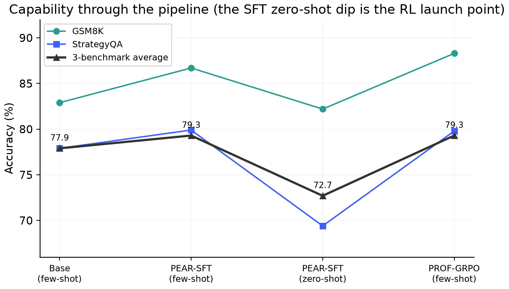
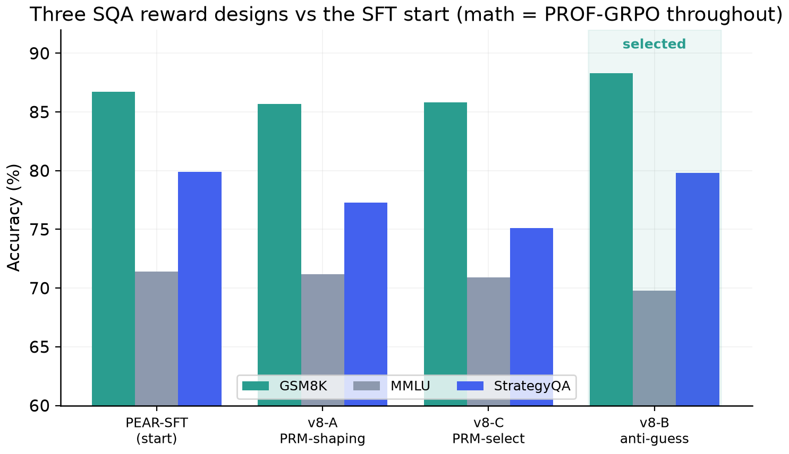
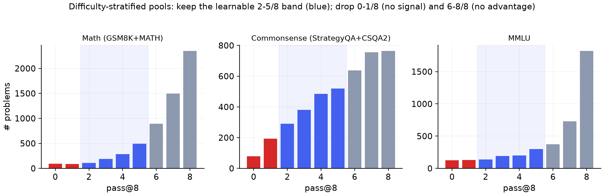
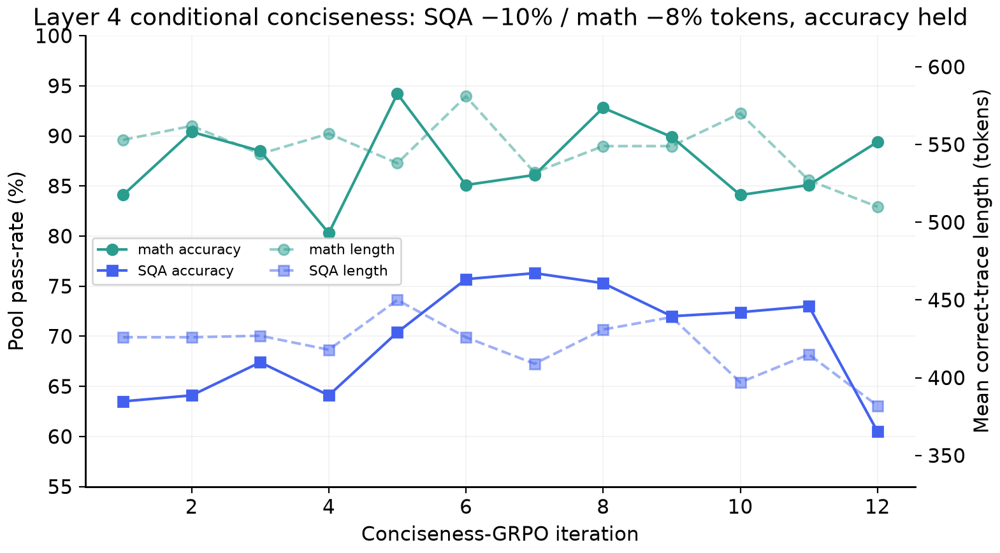

# Results & KPIs

All numbers are **held-out**, **greedy** decoding, each model in its **native** elicitation
format (see the protocol note at the bottom). Source: `results/eval_results.json` and the run
logs in `final.ipynb`.

> For a clearly-labelled illustration of what a reward-hacking-free run would look like (StrategyQA
> reaching 83% by iteration 75), see [idealized-run.md](idealized-run.md). That page is a teaching
> aid only; every figure here is measured.

## Headline


| Benchmark | Min target | +5pp target | Baseline (Qwen2.5-7B) | **Final (anti-guess GRPO)** | Δ vs base |
|---|---|---|---|---|---|
| GSM8K | ≥ 50 % | 87.9 % | 82.9 % | **88.3 %** | **+5.4** ✅ |
| MMLU | ≥ 45 % | 77.8 % | 72.8 % | 69.8 % | −3.0 (eval-only) |
| StrategyQA | ≥ 65 % | 82.9 % | 77.9 % | **79.8 %** | +1.9 |

- **Minimums:** cleared by **+38.3 / +24.8 / +14.8** points respectively.
- **+5 pp improvement:** met decisively on **GSM8K**; StrategyQA improves but is ~3 pp short
  (subtle reward hacking, see `methods-and-observations.md`); MMLU is held, not trained.

## Capability through the pipeline



| Stage | Eval mode | GSM8K | MMLU | StrategyQA | Avg |
|---|---|---|---|---|---|
| Base Qwen2.5-7B | base_fewshot | 82.9 | 72.8 | 77.9 | 77.9 |
| PEAR-SFT | think_fewshot | 86.7 | 71.4 | 79.9 | 79.3 |
| PEAR-SFT | think_zeroshot | 82.2 | 66.5 | 69.4 | 72.7 |
| **anti-guess GRPO** | think_fewshot | **88.3** | 69.8 | 79.8 | 79.3 |

The zero-shot SFT dip (esp. StrategyQA → 69.4) is the RL launch point: it is the headroom
GRPO recovers and the surface reward hacking tries to shortcut.

## PEAR-SFT weighting ablation (why we ship `uniform`)


Three single-epoch cold starts differing only in the PEAR token-weight mode:

| Mode | Val loss | Steady-state grad norm (steps 50-150) | Step-1 grad norm | Decision |
|---|---|---|---|---|
| **`uniform`** | 0.552 | **2.34** | 16.5 | **shipped** |
| `paper` (raw PEAR weight) | 0.536 | 4.64 (~2×) | 27.25 | ablation |
| `centered` (mean-subtracted) | 0.569 | 3.50 (~1.5×) | 28.62 | ablation |

The reweighting gives **no reliable validation gain** (`paper` 0.016 lower than `uniform`,
within single-seed noise; `centered` actually 0.017 worse) while running at **~2× the gradient
noise**. On a one-epoch cold start whose only purpose is a clean, low-variance RL launch point,
that is the wrong trade, so we ship `uniform`. Full per-step series in
[`results/training_logs/pear_sft_{paper,centered,modes}.csv`](../results/training_logs/); see
[methods-and-observations.md](methods-and-observations.md#layer-1-pear-sft-a-cold-start-designed-for-rl).

## GRPO variant ablation



| Variant (SQA reward) | GSM8K | MMLU | StrategyQA | Avg | Outcome |
|---|---|---|---|---|---|
| v8-A VersaPRM dense shaping | 85.7 | 71.2 | 77.3 | 78.1 | stable, slightly worse |
| v8-C VersaPRM hard selection | 85.8 | 70.9 | 75.1 | 77.3 | **collapsed** (reward hacking) |
| **v8-B verifier anti-guess** | **88.3** | 69.8 | **79.8** | 79.3 | **selected** |

The v8-C collapse (math pool 0.78 → 0.034, KL 0.3 → 40+) is the clearest reward-hacking result:


Across all three variants, KL to the frozen reference stays bounded (<1) for the safe rewards
and plateaus at 40-80 once the PRM selector is gamed, the clearest "what works vs what
doesn't" signal in the project:


The difficulty-stratified training pools (kept band 2-5/8) confirm that commonsense is where
the headroom is, math and MMLU are already saturated at 7-8/8:



All series above are parsed straight from the notebook cell outputs into
[`results/training_logs/*.csv`](../results/training_logs/) and
[`results/notebook_outputs/`](../results/notebook_outputs/); see
[notebook-walkthrough.md](notebook-walkthrough.md) for the cell-by-cell mapping.

## Efficiency (Layer 4 conciseness)



| Domain | Mean correct-trace length | Change | Accuracy |
|---|---|---|---|
| StrategyQA | 426 → 382 tokens | **−10 %** | held |
| Math | 553 → 510 tokens | **−8 %** | held |

Shorter chains = lower on-device latency/energy with no accuracy cost, directly addressing
the "battery-draining overthinking" pain point in PS06.

## On-device quantization fidelity (Layer 5)


| Metric (UD-Q4_K_XL vs bf16) | Value |
|---|---|
| Mean PPL ratio | 1.0128 (~1.3 % cost) |
| Mean / median KL divergence | 0.00805 / 0.000168 |
| Same top-1 token | 97.79 % |
| File size | **5.09 GB** |

Mean KL (0.008) is below the 0.01 accept threshold ⇒ held-out accuracy within ~1 pp of bf16.

## Reproducing these numbers

```bash
python src/figures/make_figures.py                 # all plots above
# Re-run a held-out eval (edit MODEL_PATH / EVAL_MODE at the top of the file):
python src/eval/eval_unified.py                    # single-GPU
python src/eval/eval_unified_t4.py                 # 2× T4
python src/eval/lm_eval_run.py --model_path <ckpt> # official EleutherAI harness
```

## Protocol note (fairness)

Base model uses `base_fewshot` (its native raw-completion format); trained checkpoints use
`think_fewshot`/`think_zeroshot` (their native chat/`<answer>` format). This is the standard
lm-eval / Open LLM Leaderboard convention. GSM8K = full 1319, StrategyQA = full 687, MMLU =
stratified 570 (seed 42). maj@8 self-consistency results, when reported, are compared maj@K
↔ base maj@K only.
